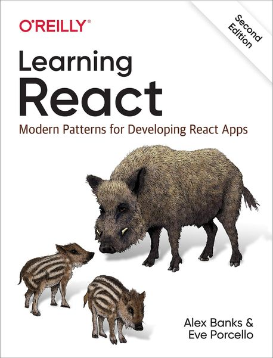

# Book Sample Codes

## Scheme Lisp 

  

📎 Reference

 Lecture : <a href ="https://ocw.mit.edu/courses/6-001-structure-and-interpretation-of-computer-programs-spring-2005/video_galleries/video-lectures/">Link</a>

 Document : <a href = "https://mitp-content-server.mit.edu/books/content/sectbyfn/books_pres_0/6515/sicp.zip/index.html">Link</a

## C# 

  
  
  

📎 Reference

EssntialCsharp Git(ENG) : <a href = "https://github.com/IntelliTect/EssentialCSharp"> Link</a> 

EffectiveCsharp Git(ENG) : <a href = "https://github.com/BillWagner/EffectiveCSharpAnalyzers"> Link</a> 

MoreEffectiveCsharp Git(ENG) : <a href = "https://github.com/BillWagner/MoreEffectiveCSharpAnalyzers"> Link</a>

## Flutter

  

📎 Reference

 Git : <a href = "https://github.com/codefactory-co/flutter-golden-rabbit-novice-v2"> Link</a> 

## JavaScript 

  
  

📎 Reference

 JavaScript Everywhere Git(ENG) : <a href = "https://github.com/javascripteverywhere"> Link</a> 

 Multithreaded JavaScript Git(ENG) : <a href = "https://github.com/MultithreadedJSBook"> Link</a> 

## React 

  
  

📎 Reference

 React Programming Youtube : <a href = "https://www.youtube.com/watch?v=AoMv0SIjZL8&list=PLuHgQVnccGMCOGstdDZvH41x0Vtvwyxu7"> Link</a> 

 React Programming Git : <a href = "https://github.com/egoing/react-2022-tutorial-src"> Link</a> 

 Learning React Git(ENG) : <a href = "https://github.com/MoonHighway/learning-react"> Link</a>
 

 Learning React Git(KOR) : <a href = "https://github.com/enshahar/learning-react-kor"> Link</a>

## Nand to Tetirs

  

📎 Reference

 Site : <a href = "https://www.nand2tetris.org/"> Link</a> 

