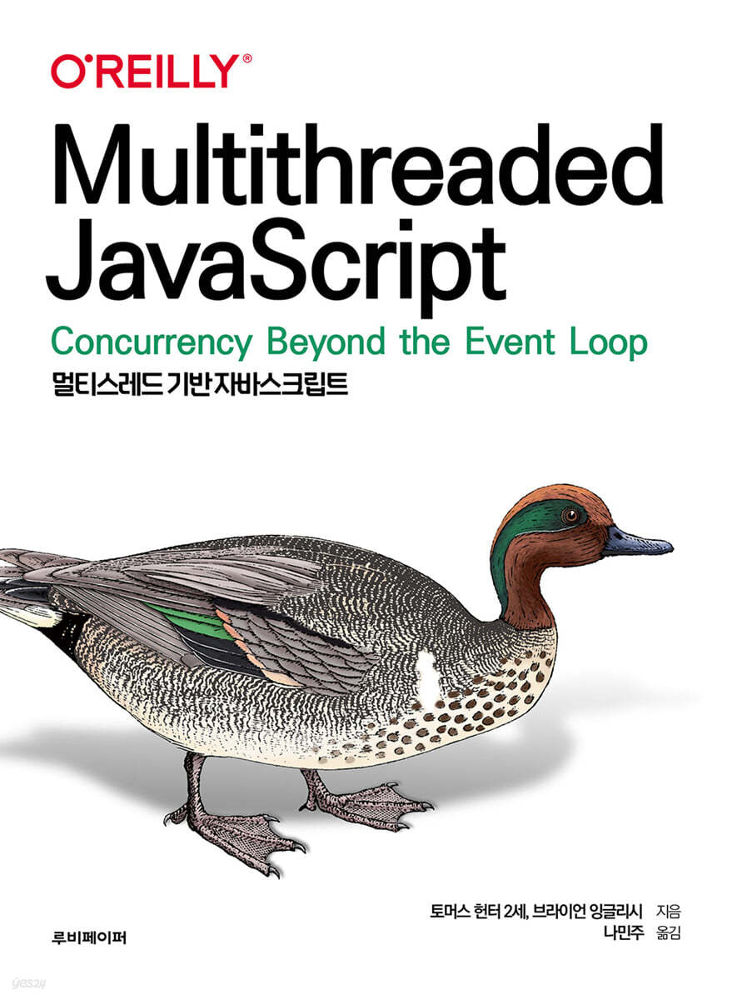

# JavaScript_training

### 1. Codeit : 프로그래밍 기초 in JavaScript

  
  
  

### 2. Codeig : JavaScript 중급

  
  
  
  

### 3. JavaScript is Everywhere

📎 Reference

 Git(ENG) : <a href = "https://github.com/javascripteverywhere"> Link</a> 

### 4. Multithreaded JavaScript

📎 Reference

 Git(ENG) : <a href = "https://github.com/MultithreadedJSBook"> Link</a> 

