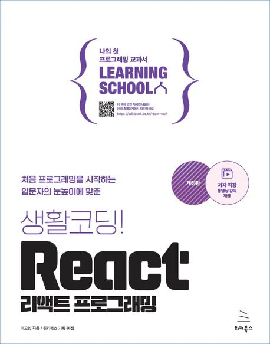

# react_training

### 1. 생활코딩! React Programming

📎 Reference

 Youtube : <a href = "https://www.youtube.com/watch?v=AoMv0SIjZL8&list=PLuHgQVnccGMCOGstdDZvH41x0Vtvwyxu7"> Link</a> 

 Git : <a href = "https://github.com/egoing/react-2022-tutorial-src"> Link</a> 

### 2. Learning React

📎 Reference

 Git(ENG) : <a href = "https://github.com/MoonHighway/learning-react"> Link</a> 

 Git(KOR) : <a href = "["](https://github.com/enshahar/learning-react-kor)https://github.com/enshahar/learning-react-kor> Link</a> 

